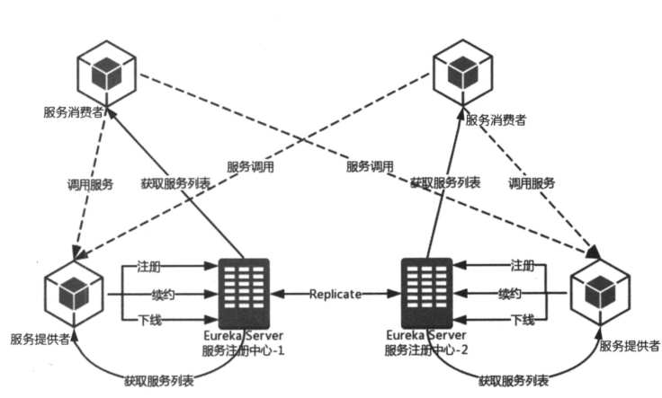

# Springcloud学习笔记

## 服务治理

* 服务注册：在服务治理框架中，通常都会构建一个注册中心，每个服务单元向注册中心登记自己提供的服务，将主机与端口、版本号、通信协议等一些附加信息告知注册注册中心，注册中心按服务分类组织服务清单。服务注册中心还需要以心跳的方式去检测清单中的服务是否可用，若不可用需要从服务清单中剔除，达到排除故障服务的效果。
* 服务发现：由于服务治理框架下运作，服务间的调用不在通过制定的具体的实例地址来实现，而是通过向服务名发起请求调用实现。服务调用方在调用服务提供方接口的时候，并不知道具体服务实例位置，服务调用方需要向服务注册中心咨询服务，并获取所有服务的实例清单，以是实现对具体的服务实例的访问。

### 服务治理基础架构

1. **服务注册中心** ：Eureka 提供的服务端，提供服务注册与发现的能力
2. **服务提供者** ：提供服务的应用，可以是 Springboot 应用，也可以是其他技术平台上遵循 Eureka 通信机制的应用。它将自己提供的服务注册到 Eureka 中，以供其他应用发现。
3. **服务消费者** ：消费者应用从服务注册中心获取服务列表，从而是消费者可以知道去何处调用其所需要的服务。

### 服务治理机制



#### 服务提供者

* **服务注册** ：服务提供者在启动的时候会通过 REST 请求的方式将自己注册到 Eureka Server 上，同时带上自身服务的一些元数据信息。Eureka Server 接收到这个 REST 请求之后，将元数据信息存储在一个双层结构 Map 中，其中第一层的 Key 是服务名，第二层的 Key 是具体的服务的实例名。
* **服务同步** ：这里两个服务提供者分别注册到了俩个不同的服务注册中心上，也就是说，他们的信息分别被俩个服务注册中心所维护。由于两个服务注册中心之间因互相注册的服务，当服务提供者发送注册请求到一个服务注册中心是，它会将该请求转发给集群中相连的其他注册中心，从而实现注册中心之间的服务同步。通过服务同步，两个服务提供者的服务信息就可以通过这两台服务注册中心中的任意一台获取到。
* **服务续约** ：在注册完服务之后，服务提供者会维护一个心跳用来持续告诉 Eureka Server：“我还活着”，以防止 Eureka Server 的“剔除任务”将该服务实例从服务列表中排除出去，以完成服务续约

#### 服务消费者

* **获取服务** ：当我们启动服务消费者的时候，他会发送一个 REST 请求给服务注册中心，来获取上面注册的服务清单。为了性能考虑，Eureka Server 会维护一份只读服务清单来返回给客户端，同时该缓存清单会每隔30秒跟新一次
* **服务调用** ：服务消费者在获取服务清单后，通过服务名可以获取具体的服务实例名和该实例的元数据信息。
* **服务下线** ：在系统运行过程中必然会面临关闭或者重启服务的某个实例的情况，在服务关闭期间，我们自然不希望客户端会继续调用关闭了的实例。所以当在客户端程序中，当服务实例进行正常的关闭操作时，他会触发一个服务下线的 REST 请求给 Eureka Server，告诉服务注册中心：“我要下线了”。服务端在接手请求之后，将该服务状态设置为下线（DOWN），并把该下线事件传播出去

#### 服务注册中心

* **失效剔除** ：有些服务实例并不一定会正常下线，可以由于内存溢出、网络故障灯原因使得服务不能正常工作，而服务注册中心并未收到“服务下线”的请求。为了从服务列表中这些无法提供服务的实例剔除，Eureka Server 在启动的时候会创建一个定时任务，默认每隔一段时间（默认为60秒），将当前清单中超时（默认为90秒）没有续约的服务剔除
* **自我保护** ：

### Eureka

Spring Cloud Eureka，使用 Netflix Eureka 来实现服务注册与发现，它既包含服务端组件，也包含客户端组件，并且服务端与客户端均采用 Java 编写。

**Eureka 服务端（注册中心）**：支持高可用，如果 Eureka 以集群模式部署，当集群中有分片出现故障时，那么 Eureka 就转入自我保护模式。它允许在分片故障期间继续提供服务的发现与注册，当故障分片恢复运行时，集群中的其他分片会把他们的状态再次同步过来。

**Eureka 客户端** ：主要处理服务的注册与发现。客户端服务通过注解和参数配置的方式，嵌入在客户端应用程序的代码中，在应用程序运行时，Eureka 客户端会想注册中心注册自身提供的服务并周期性发送心跳来更新他的服务租约。同时，它也能从服务端查询当前注册的服务信息并把它们缓存到本地并周期性的刷新服务状态

#### Eureka 服务搭建

##### Eureka 注册中心

###### pom.xml

```xml
<?xml version="1.0" encoding="UTF-8"?>
<project xmlns="http://maven.apache.org/POM/4.0.0"
         xmlns:xsi="http://www.w3.org/2001/XMLSchema-instance"
         xsi:schemaLocation="http://maven.apache.org/POM/4.0.0 http://maven.apache.org/xsd/maven-4.0.0.xsd">
    <modelVersion>4.0.0</modelVersion>

    <groupId>top.simba1949</groupId>
    <artifactId>Eureka-RegistrationCenter</artifactId>
    <version>1.0-SNAPSHOT</version>

    <parent>
        <groupId>org.springframework.boot</groupId>
        <artifactId>spring-boot-starter-parent</artifactId>
        <version>2.0.1.RELEASE</version>
    </parent>
    <dependencyManagement>
        <dependencies>
            <dependency>
                <groupId>org.springframework.cloud</groupId>
                <artifactId>spring-cloud-dependencies</artifactId>
                <version>Finchley.SR1</version>
                <type>pom</type>
                <scope>import</scope>
            </dependency>
        </dependencies>
    </dependencyManagement>
    <dependencies>
        <dependency>
            <groupId>org.springframework.cloud</groupId>
            <artifactId>spring-cloud-starter-config</artifactId>
        </dependency>
        <dependency>
            <groupId>org.springframework.cloud</groupId>
            <artifactId>spring-cloud-starter-netflix-eureka-server</artifactId>
        </dependency>
    </dependencies>
</project>
```

###### 启动类 Application.java

```java
package top.simba1949;

import org.springframework.boot.SpringApplication;
import org.springframework.boot.WebApplicationType;
import org.springframework.boot.autoconfigure.SpringBootApplication;
import org.springframework.boot.builder.SpringApplicationBuilder;
import org.springframework.cloud.netflix.eureka.server.EnableEurekaServer;

/**
 * @author simba1949@outlook.com
 * @date 2018/9/16 8:41
 * @EnableEurekaServer 启动一个服务注册中心
 */
@EnableEurekaServer
@SpringBootApplication
public class Application {
    public static void main(String[] args) {
        new SpringApplicationBuilder(Application.class).web(true).run(args);
    }
}
```

###### application.properties

```properties
server.port=1111
spring.application.name=eureka-server
eureka.instance.hostname=localhost
# eureka 即作为服务端也是客户端，表示 eureka 不能向注册中心注册自己
eureka.client.register-with-eureka=false
# 由于注册中心的职责就是维护服务实例，不需要检索服务，所以设置为 false
eureka.client.fetch-registry=false
eureka.client.service-url.defaultZone=http://${eureka.instance.hostname}:${server.port}/eureka
```

###### 访问测试

访问 http://localhost:1111，可以看到 Eureka 信息面板


##### 注册服务提供者

###### pom.xml

```xml
<?xml version="1.0" encoding="UTF-8"?>
<project xmlns="http://maven.apache.org/POM/4.0.0"
         xmlns:xsi="http://www.w3.org/2001/XMLSchema-instance"
         xsi:schemaLocation="http://maven.apache.org/POM/4.0.0 http://maven.apache.org/xsd/maven-4.0.0.xsd">
    <modelVersion>4.0.0</modelVersion>

    <groupId>top.simba1949</groupId>
    <artifactId>Eureka-ServiceProvider</artifactId>
    <version>1.0-SNAPSHOT</version>

    <parent>
        <groupId>org.springframework.boot</groupId>
        <artifactId>spring-boot-starter-parent</artifactId>
        <version>2.0.1.RELEASE</version>
    </parent>
    <dependencyManagement>
        <dependencies>
            <dependency>
                <groupId>org.springframework.cloud</groupId>
                <artifactId>spring-cloud-dependencies</artifactId>
                <version>Finchley.SR1</version>
                <type>pom</type>
                <scope>import</scope>
            </dependency>
        </dependencies>
    </dependencyManagement>
    <dependencies>
        <dependency>
            <groupId>org.springframework.cloud</groupId>
            <artifactId>spring-cloud-starter-config</artifactId>
        </dependency>
        <dependency>
            <groupId>org.springframework.cloud</groupId>
            <artifactId>spring-cloud-starter-netflix-eureka-client</artifactId>
        </dependency>

        <dependency>
            <groupId>org.springframework.boot</groupId>
            <artifactId>spring-boot-starter-web</artifactId>
        </dependency>
        <dependency>
            <groupId>org.springframework.boot</groupId>
            <artifactId>spring-boot-starter-test</artifactId>
            <scope>test</scope>
        </dependency>
    </dependencies>
</project>
```

###### 启动类 Application.java

````java
package top.simba1949;

import org.springframework.boot.SpringApplication;
import org.springframework.boot.autoconfigure.SpringBootApplication;
import org.springframework.cloud.netflix.eureka.EnableEurekaClient;

/**
 * @author simba1949@outlook.com
 * @date 2018/9/16 9:
 * @EnableEurekaClient ：激活 Eureka 中的 DiscoveryClient 实现（自动化配置，创建 DiscoveryClient 接口针对 Eureka 客户端的 EurekaDiscoveryClient 实例）
 */
@EnableEurekaClient
@SpringBootApplication
public class Application {
    public static void main(String[] args) {
        SpringApplication.run(Application.class,args);
    }
}
````

###### HelloController.java

```java
package top.simba1949.controller;

import org.slf4j.Logger;
import org.slf4j.LoggerFactory;
import org.springframework.web.bind.annotation.GetMapping;
import org.springframework.web.bind.annotation.RestController;

/**
 * @author simba1949@outlook.com
 * @date 2018/9/16 9:19
 */
@RestController
public class HelloController {

    Logger logger = LoggerFactory.getLogger(HelloController.class);

    @GetMapping("/hello")
    public String sayHello(){
        logger.info("HelloController.sayHello()");
        return "Hello World";
    }
}
```

###### application.properties

```properties
#指定服务名
spring.application.name=hello-service
#指定注册中心
eureka.client.service-url.defaultZone=http://localhost:1111/eureka
```

###### 访问测试

再次访问 http://localhost:1111，可以看到 Eureka 信息面板


##### Eureka 高可用注册中心

> 在微服务架构这样的分布式环境中，需要充分考虑发生的故障的情况，所以在生产环境中必须对各个组件进行高可用部署，对于微服务如此，对于服务注册中心也一样。

###### Eureka 注册中心 peer1

pom.xml

```xml
<?xml version="1.0" encoding="UTF-8"?>
<project xmlns="http://maven.apache.org/POM/4.0.0"
         xmlns:xsi="http://www.w3.org/2001/XMLSchema-instance"
         xsi:schemaLocation="http://maven.apache.org/POM/4.0.0 http://maven.apache.org/xsd/maven-4.0.0.xsd">
    <modelVersion>4.0.0</modelVersion>

    <groupId>top.simba1949</groupId>
    <artifactId>Eureka-RegistrationCenter4Highavailability</artifactId>
    <version>1.0-SNAPSHOT</version>

    <parent>
        <groupId>org.springframework.boot</groupId>
        <artifactId>spring-boot-starter-parent</artifactId>
        <version>2.0.1.RELEASE</version>
    </parent>
    <dependencyManagement>
        <dependencies>
            <dependency>
                <groupId>org.springframework.cloud</groupId>
                <artifactId>spring-cloud-dependencies</artifactId>
                <version>Finchley.SR1</version>
                <type>pom</type>
                <scope>import</scope>
            </dependency>
        </dependencies>
    </dependencyManagement>
    <dependencies>
        <dependency>
            <groupId>org.springframework.cloud</groupId>
            <artifactId>spring-cloud-starter-config</artifactId>
        </dependency>
        <dependency>
            <groupId>org.springframework.cloud</groupId>
            <artifactId>spring-cloud-starter-netflix-eureka-server</artifactId>
        </dependency>
    </dependencies>
</project>
```

启动类 Application.java

```java
package top.simba1949;

import org.springframework.boot.autoconfigure.SpringBootApplication;
import org.springframework.boot.builder.SpringApplicationBuilder;
import org.springframework.cloud.netflix.eureka.server.EnableEurekaServer;

/**
 * @author simba1949@outlook.com
 * @date 2018/9/16 8:41
 * @EnableEurekaServer 启动一个服务注册中心
 */
@EnableEurekaServer
@SpringBootApplication
public class Application {
    public static void main(String[] args) {
        new SpringApplicationBuilder(Application.class).web(true).run(args);
    }
}
```

application.properties

```properties
server.port=1001
spring.application.name=eureka-server
eureka.instance.hostname=peer1

eureka.client.service-url.defaultZone=http://peer2:1002/eureka
```

访问测试


###### Eureka 注册中心 peer2

pom.xml

```xml
<?xml version="1.0" encoding="UTF-8"?>
<project xmlns="http://maven.apache.org/POM/4.0.0"
         xmlns:xsi="http://www.w3.org/2001/XMLSchema-instance"
         xsi:schemaLocation="http://maven.apache.org/POM/4.0.0 http://maven.apache.org/xsd/maven-4.0.0.xsd">
    <modelVersion>4.0.0</modelVersion>

    <groupId>top.simba1949</groupId>
    <artifactId>Eureka-RegistrationCenter4HighavailabilityTwo</artifactId>
    <version>1.0-SNAPSHOT</version>

    <parent>
        <groupId>org.springframework.boot</groupId>
        <artifactId>spring-boot-starter-parent</artifactId>
        <version>2.0.1.RELEASE</version>
    </parent>
    <dependencyManagement>
        <dependencies>
            <dependency>
                <groupId>org.springframework.cloud</groupId>
                <artifactId>spring-cloud-dependencies</artifactId>
                <version>Finchley.SR1</version>
                <type>pom</type>
                <scope>import</scope>
            </dependency>
        </dependencies>
    </dependencyManagement>
    <dependencies>
        <dependency>
            <groupId>org.springframework.cloud</groupId>
            <artifactId>spring-cloud-starter-config</artifactId>
        </dependency>
        <dependency>
            <groupId>org.springframework.cloud</groupId>
            <artifactId>spring-cloud-starter-netflix-eureka-server</artifactId>
        </dependency>
    </dependencies>
</project>
```

启动类 Application.java

```java
package top.simba1949;

import org.springframework.boot.autoconfigure.SpringBootApplication;
import org.springframework.boot.builder.SpringApplicationBuilder;
import org.springframework.cloud.netflix.eureka.server.EnableEurekaServer;

/**
 * @author simba1949@outlook.com
 * @date 2018/9/16 8:41
 * @EnableEurekaServer 启动一个服务注册中心
 */
@EnableEurekaServer
@SpringBootApplication
public class Application {
    public static void main(String[] args) {
        new SpringApplicationBuilder(Application.class).web(true).run(args);
    }
}
```

application.properties

```properties
server.port=1002
spring.application.name=eureka-server
eureka.instance.hostname=peer2

eureka.client.service-url.defaultZone=http://peer1:1001/eureka
```

访问测试


##### 服务发现与消费

> 构建一个服务消费者，主要完成两个目标，发现服务以及消费服务。其中服务发现任务有 **Eureka客户端** 完成，而服务消费的任务有 **Ribbon** 完成。**Ribbon** 是一个基于 HTTP 和 TCP 的客户端负载均衡器，他可以在通过客户端中配置的 ribbonServerList 服务端列表去轮询访问以达到负载均衡的作用。当 Ribbon 与 Eureka 联合使用时，Ribbon 的服务实例清单 RibbonServerList 会被 DiscoveryEnabledNIWSServerList 重写，扩展成从 Eureka 注册中心中获取服务端列表。同时它也会用 NIWSDiscoveryPingRibbon 来代替 IPing，它将职责托给 Eureka来确定服务端是否已经启动。

###### pom.xml

```xml
<?xml version="1.0" encoding="UTF-8"?>
<project xmlns="http://maven.apache.org/POM/4.0.0"
         xmlns:xsi="http://www.w3.org/2001/XMLSchema-instance"
         xsi:schemaLocation="http://maven.apache.org/POM/4.0.0 http://maven.apache.org/xsd/maven-4.0.0.xsd">
    <modelVersion>4.0.0</modelVersion>

    <groupId>top.simba1949</groupId>
    <artifactId>Eureka-Comsumer</artifactId>
    <version>1.0-SNAPSHOT</version>

    <parent>
        <groupId>org.springframework.boot</groupId>
        <artifactId>spring-boot-starter-parent</artifactId>
        <version>2.0.1.RELEASE</version>
    </parent>
    <dependencyManagement>
        <dependencies>
            <dependency>
                <groupId>org.springframework.cloud</groupId>
                <artifactId>spring-cloud-dependencies</artifactId>
                <version>Finchley.SR1</version>
                <type>pom</type>
                <scope>import</scope>
            </dependency>
        </dependencies>
    </dependencyManagement>
    <dependencies>
        <dependency>
            <groupId>org.springframework.cloud</groupId>
            <artifactId>spring-cloud-starter-config</artifactId>
        </dependency>
        <dependency>
            <groupId>org.springframework.cloud</groupId>
            <artifactId>spring-cloud-starter-netflix-eureka-client</artifactId>
        </dependency>

        <dependency>
            <groupId>org.springframework.boot</groupId>
            <artifactId>spring-boot-starter-web</artifactId>
        </dependency>
        <dependency>
            <groupId>org.springframework.cloud</groupId>
            <artifactId>spring-cloud-starter-netflix-ribbon</artifactId>
        </dependency>
    </dependencies>
</project>
```

###### 启动类 Application.java

```java
package top.simba1949;

import org.springframework.boot.SpringApplication;
import org.springframework.boot.autoconfigure.SpringBootApplication;
import org.springframework.cloud.client.discovery.EnableDiscoveryClient;
import org.springframework.cloud.client.loadbalancer.LoadBalanced;
import org.springframework.context.annotation.Bean;
import org.springframework.web.client.RestTemplate;

/**
 * @author simba1949@outlook.com
 * @date 2018/9/16 10:38
 * @EnableDiscoveryClient :该注解让该应用祖册为 Eureka 客户端应用，以获得服务发现的能力
 * 同时在该主类中创建 RestTemplate 的 Spring Bean 实例，并通过 @LoadBalanced 注解开启客户端的负载均衡
 */
@EnableDiscoveryClient
@SpringBootApplication
public class Application {

    @Bean
    @LoadBalanced
    RestTemplate restTemplate(){
        return new RestTemplate();
    }

    public static void main(String[] args) {
        SpringApplication.run(Application.class,args);
    }
}

```

###### ConsumerController.java

```java
package top.simba1949.controller;

import org.springframework.beans.factory.annotation.Autowired;
import org.springframework.web.bind.annotation.GetMapping;
import org.springframework.web.bind.annotation.RestController;
import org.springframework.web.client.RestTemplate;

/**
 * @author simba1949@outlook.com
 * @date 2018/9/16 10:42
 */
@RestController
public class ConsumerController {

    @Autowired
    RestTemplate restTemplate;

    @GetMapping("ribbon-consumer")
    public String helloConsumer(){
        String string = restTemplate.getForEntity("http://HELLO-SERVICE/hello", String.class).getBody();
        return string;
    }
}
```

###### application.properties

```properties
spring.application.name=ribbon-consumer
server.port=8081

eureka.client.service-url.defaultZone=http://peer1:1111/eureka
```

###### 访问测试


#### 

##### 

